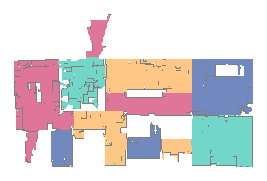

# Valetudo-Image-Converter



This is a small and rather hackish script, which takes a ValetudoMap JSON and renders it to a binary PPM. It's not a "good" image format, but it's easy to create one without any dependencies. Use some random image converter online or use ImageMagick to turn it into a format that's actually useful:

```
$ convert img.ppm img.png
```

Go ahead. Have fun

## Usage

```
npm install

node app.js /path/to/map.json /path/to/output.ppm 
```
